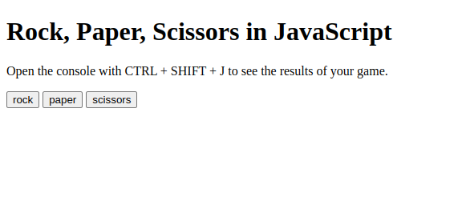

# ROCK, PAPER, SCISSORS
Rock Paper Scissors project for TheOdinProject Foundations JavaScript Basics module.

**Link to project:** http://www.andyglover.io/odin-rock-paper-scissors/

## How It's Made:

**Tech used:** HTML, JavaScript

This one was really fun to build, and was really wild to see that I could create an entertaining experience with HTML and Javascript. It got me excited about the possibilities of what I could build!

## Optimizations

I'd like to add images to the rock, paper and scissors buttons, and I'd like to create a better scoreboard.

## Lessons Learned:

Aside from the logic of the game itself, it was fun to learn how to manipulate the elements on the page to keep track of the scores, and hide or show certain elements when appropriate.

## Examples:
Here's a few more repositories of mine you might like to check out:

**ANDYGLOVER.DEV:** https://github.com/andyglover/andyglover.dev

**GIF Thingy:** https://github.com/andyglover/gif-thingy

**Calculator:** https://github.com/andyglover/odin-calculator